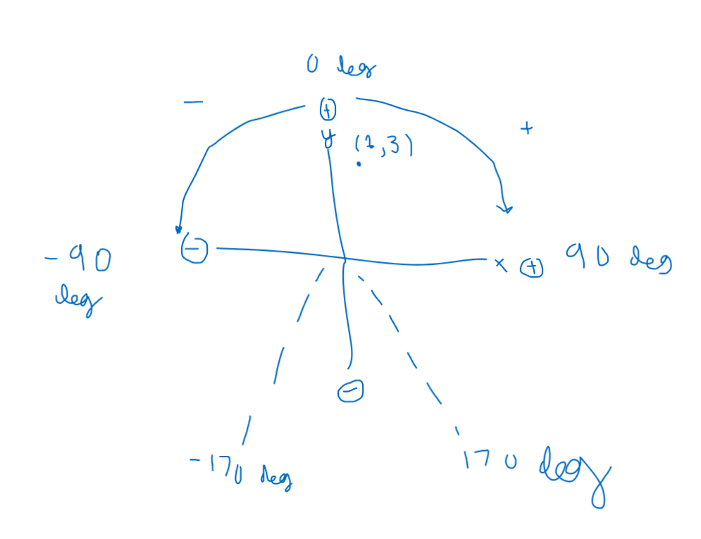

# 765X 2023-2024 VEX Season

Lead Programmer: Eshaan Barkataki

## Specifications
For Adi - the best programmer lowk ngl like fr fr.

And other people who stumbled upon this.

* First: `main.cpp` is where op control. 
    * If you want to change any keybinds for controller: go over there
    * You could also slow the heading down if you would like. I actually commented some code in the opcontrol
    * you will also see the auton void func. In there you see it calls `Routes::leftRisky()`.
* Routes functions are under `src/routes`
    * go the `leftRisk.cpp` . This is what is called in the main.cpp.
    * A good example of a route is `src/routes/left.cpp` or `src/routes/right.cpp`; use those examples to help
    * I use relative. However you can use absolute.
        * These functions are `faceToPoint`, & `goToPoint`
        * Also never tested, if the robot is going to a point that is NOT facing (ie if robot degree is 0 and the target point is (1,1) ), then `goToPoint` THEORETICALLY actives both heading and distance PID to best go to that point.
            * Although, prolly not going to work in practice.
            * Just make sure you use `faceToPoint` before `goToPoint`
        * To be fair, never tested the absolute functions before (should be fine tho), but if those don't work use relative.
* Effectors are fairly self explanatory; I made some functions (Ex: `setIntake`)
* **Coordinate system:**
    * **IMPORTANT!**
    * This is NOT okapi coordinate system!!! I wrote my own odom. 
    * This is best explained via image
    </img>
    * Also note that you could set the position of the odom anytime you would like via `OdomCustom::setPos`. This is used in `left.cpp`
* Also note that if you want to print something, you use `Console::printBrain()` - this is a custom function that prints smaller text onto the brain.

THAT's pretty much it happy coding

## Features: 

* Simulation for Odometery: defined in odom/OdomSim.h
    * without the need to have an entire coding drivebase (although this would be really helpful), you could use the simulated version to test your PID loop functions or what not
    
    * Definitely not a full-blown vehicle simulator (that would be insane), but it replicates arcade drive somewhat (with acceleration and decelleration)

    * Very deterministic simulation! Defined in `odom/OdomSim.hpp`

* Custom ODOM (**Not tested**):
    * Just a custom odometry 
    * idk not tested yet and probably will change the entire process entirely
    * *Need physical hardware to test, like a prog codebase*
    * Easily switch between Custom Odom or Okapi's Odom (in case the other one fails lol VEX 2022-2023)

* Bigger Console: using LVGL as a text display/interface we could basically create our own console
    * Defined in `display/Console.h`
    * could store **12** lines of useful information with more text per line 
    * Also, for overflow text it would automatically scroll horizontally instead of clipping out

* Auton selector using LVGL + risky/nonrisky step
